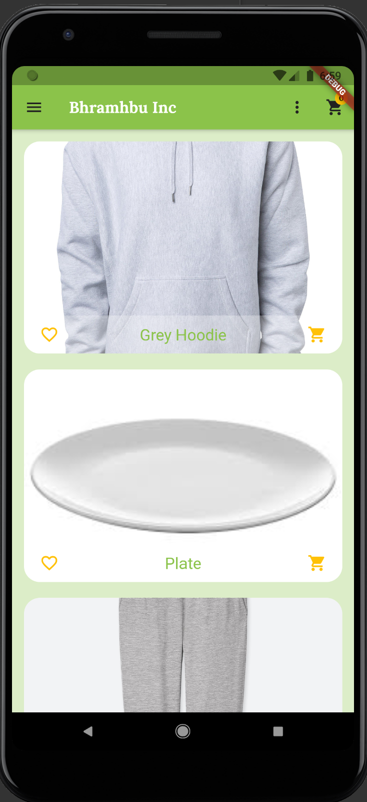
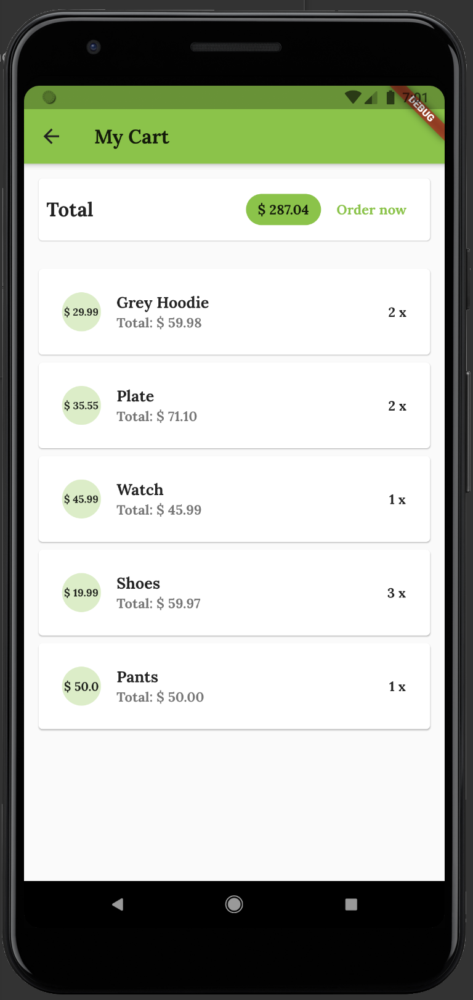
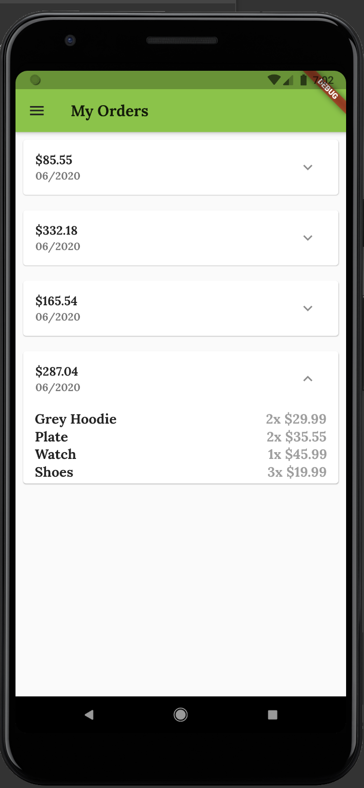

# Introduction
This is a simple shop app that currently enables users to place orders, favorite items and view their purchasing history. Currently working on allowing them to add new products and edit descriptions and prices of previous orders. Below are a few screenshots. 

# The Home Page

The user can tap on the item which will then display its price and description. They can favorite the item with the heart icon and if they choose to view favorites only, the favorites will show. The user can also place an order with the shopping cart icon which will then be visible in their cart. 

# The Cart Page

If the user wishes to delete an item, they can swipe on the item which will then delete all instances of that item in the cart. Placing an order with the "Order Now" button will clear the screen and the order will be moved to the Orders Screen which can be accessed through the drawer on the main page. 

# The Orders Page

The orders screen shows each order and the date it was ordered. By clicking the expanded icon on the right, it will display a list of the items that was purchased during the order and its details such as price and quantity. 
